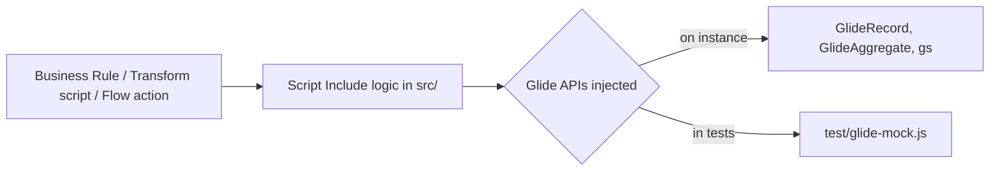

# servicenow-script-patterns

Three ServiceNow server-side script patterns, written so the logic can be unit tested with plain Node.js outside an instance.

> **Portfolio project.** Written independently as a clean-room demonstration. It contains no employer or client code, configuration or data. All sample data is synthetic.

## Why

Script Includes are often tested only by clicking through forms. Here each script takes its Glide APIs as a constructor argument, so the same logic runs on an instance (pass the real `GlideRecord`, `GlideAggregate` and `gs`) and in tests (pass the doubles in `test/glide-mock.js`).

## Patterns

| File | Used from | What it shows |
|---|---|---|
| `src/AssignmentBalancer.js` | Assignment rule or Flow action | Picks the least-loaded group member with one `GlideAggregate` query for the group, not one count query per member |
| `src/TransformDedupeHelper.js` | Transform Map onBefore script | Cleans the row, matches on serial number then name, and returns insert, update or skip. An ambiguous match is logged and skipped, never updated |
| `src/ChangeRiskCalculator.js` | Before Business Rule on `change_request` | Risk scoring kept as a pure function with no Glide calls, returning the score and the reasons behind it |



## Run the tests

Node.js 20+ and no packages to install.

```bash
npm test
```

17 tests. One asserts the query count, so an N+1 regression in the assignment logic fails the build.

## Using a script on an instance

Create a Script Include with the same name, wrap the prototype in `Class.create()`, and construct it with the platform globals:

```javascript
var balancer = new AssignmentBalancer({ GlideRecord: GlideRecord, GlideAggregate: GlideAggregate, gs: gs });
current.assigned_to = balancer.pickAssignee('incident', current.getValue('assignment_group'));
```

Remove the `module.exports` line; it only exists for Node.

## Security notes

No instance URLs, credentials or update sets are stored here. On an instance, assignment and transform logic run with the caller's or the import user's access, so ACLs still need their own tests (ATF is the right tool for that).

## Limitations

- `glide-mock.js` implements only the calls these scripts make (`=`, `!=`, `IN`). It does not evaluate encoded queries, ACLs or business rules.
- The risk thresholds are sample values. On an instance they belong in system properties or a Decision Table.

## License

MIT
